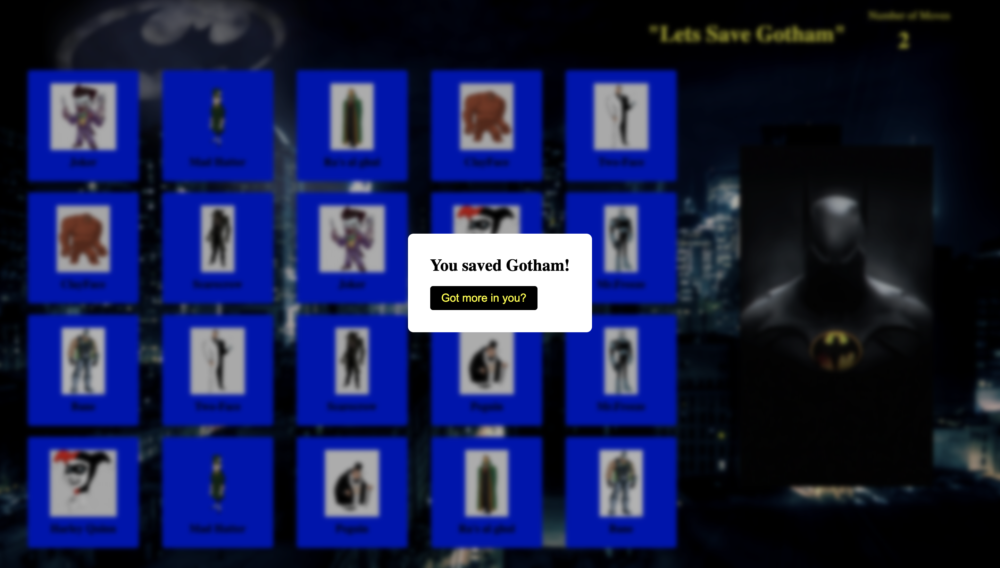

# Alex Taylor SEI-Project 1 MemoryGame2023

## Game Description - Save Gotham
"In this memory card game, you take on the role of Batman, the Dark Knight, and your mission is to save Gotham City from its notorious villains. The city is infested with criminals who must be captured and brought to justice. To achieve this, you must find matching pairs of cards that represent these villains.

The game board consists of a grid of cards, each hiding the image of a villain. Your task is to flip over two cards at a time, trying to find a matching pair. If you successfully match a pair, the cards remain face up, representing the captured villains. However, if the two cards do not match, they will be flipped back over, and you must try again.

Beware, time is of the essence! You have a limited number of moves to capture all the villains before they escape and Gotham City falls into chaos. Keep an eye on the number of moves remaining and strategize your choices wisely.

## Game pictures

This is how the game is first displayed. User is granted a limited amount of moves/clicks to match all cards to their pairs.

This image how the cards layout and data on the backside of them.

This shows how a winner is determined and what the winner pop up looks like allowing the user to click a play again button.

## Technologies Used
This memory Batman game utilizes a combination of JavaScript, HTML, and CSS to create an interactive and immersive gaming experience. JavaScript is employed for various functionalities, such as handling card selection, checking for matches, updating the game state, and managing the win or lose conditions. DOM manipulation is a key aspect of JavaScript usage, allowing for dynamic updates to the game board, counter, and modal windows.

HTML provides the structure and layout of the game, defining the elements, containers, and audio tags required. CSS is responsible for the visual styling, including card design, backgrounds, fonts, and modal windows. By leveraging these technologies, the game achieves seamless interactivity, responsive design, and a captivating user interface, enhancing the overall gameplay and immersing players in the world of Batman as they strive to save Gotham City from its villains.

## Challenging Code Parts

## Link to Game
https://lavishal.github.io/MemoryGame2023/

## Next Steps
There are a few things I plan to do with this game. Firstly, I would like to add a database and a login function where users can save their accounts so that their data is not lost in future plays. Additionally, I plan to introduce more levels with varying levels of difficulty and different categories/timelines to play in. Moreover, I would like to provide the ability to play from different points of view, allowing players to experience the game as either the hero or the foe.

### In terms of hard coded functions:
High Score Tracking: Keep track of the fastest completion times or highest scores achieved by players. Store this information in the database and display it on a leaderboard.

Hint System: Allow players to use hints during the game to reveal the location of a matching pair of cards. The hints could be limited in number or have a cooldown period.

Power-ups: Introduce power-up cards that provide special abilities when flipped, such as temporarily revealing all cards on the board or freezing the timer for a certain duration.

